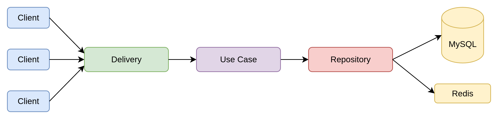
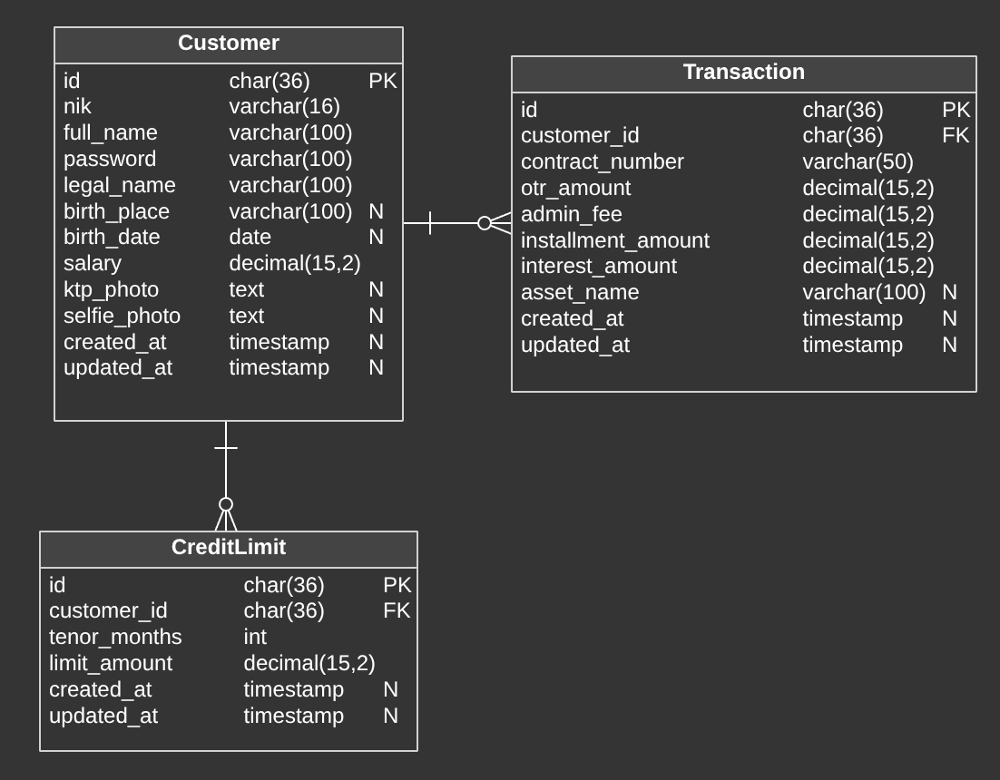

# XYZ Multifinance Technical Test – Golang Backend

This repository is the core backend API for PT XYZ Multifinance, designed to support their expanding business in white goods, motor, and car financing.

---

## Architecture Overview

This system adopts **Clean Architecture** with the following core layers:

- **Delivery Layer (HTTP)** – Handles incoming HTTP requests via [Gin](https://gofiber.io/)
- **Use Case Layer** – Contains business rules and application logic.
- **Repository Layer** – Responsible for database operations. Implements interfaces defined in the domain layer.
- **Infrastructure Layer** – Provides concrete implementations like MySQL and Redis clients, and external service connectors.

### Supporting Services

- **MySQL** – Primary relational database for customer, credit limit, and transaction data.
- **Redis** – Used for caching and locking.

---

## Entity Relationship Diagram (ERD)

### Tables:
- **Customer**  
  Stores core customer data, including NIK, legal name, salary, and identity photos.

- **CreditLimit**  
  Each customer can have credit limits per tenor.

- **Transaction**  
  Tracks each financing transaction.

---

